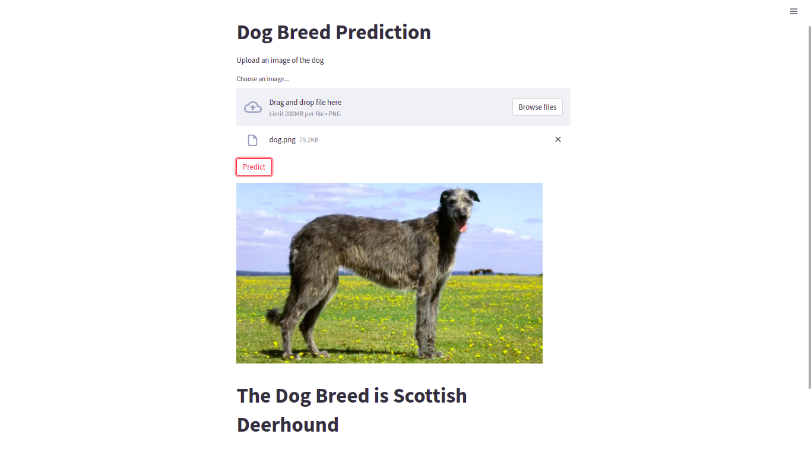

# Dog breed prediction

- Python 3
- Cv2
- Numpy
- Streamlit
- Keras

---

# Installation on Linux and Unix like OS

- `git clone https://github.com/lenargasimov/dog-breed-prediction.git`
- `cd dog-breed-prediction`
- `python3 -m pip install -r requirements.txt`
- `python3 main.py`

# Instalation on Windows

- `git clone https://github.com/lenargasimov/dog-breed-prediction.git`
- `cd dog-breed-prediction`
- `python -m pip install -r requirements.txt`
- `python main.py`
